# Azure Network Security Architecture Project

## Project Overview

This project demonstrates a secure Azure network architecture using a segmented application design.

The environment consists of:

* A public-facing Web Server VM
* A private Database VM
* Network Security Groups (NSGs) controlling traffic flow
* Secure administrative access through restricted SSH rules
* Validation tests proving allowed and blocked traffic

The goal was to implement a real-world cloud security model where only required communication paths are permitted.

---

# Architecture Design

```text
                         Internet
                            |
                            |
                 HTTP (80) / HTTPS (443)
                            |
                            ▼
                 CONTOSO-WEB-01
                 Ubuntu 24.04
                 Private IP: 10.30.1.4
                 Public IP: Enabled
                            |
                            |
                    MySQL TCP 3306
                            |
                            ▼
                 CONTOSO-DB-01
                 Ubuntu 24.04
                 Private IP: 10.30.2.4
                 Public IP: Removed
```

---

# Azure Resources

## Resource Group

Resource group used:

* RG-CONTOSO-SECURITY

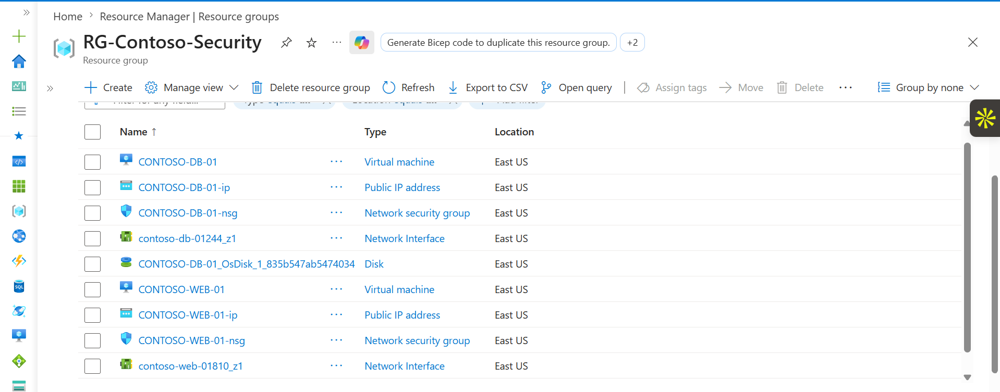

---

## Virtual Machines

Deployed:

| VM             | Role            | Subnet          |
| -------------- | --------------- | --------------- |
| CONTOSO-WEB-01 | Web Server      | Web-Subnet      |
| CONTOSO-DB-01  | Database Server | Database-Subnet |

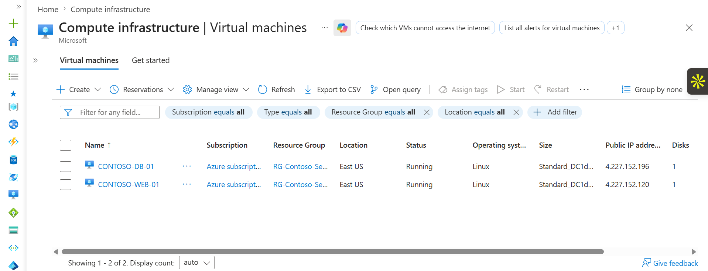

---

# Network Design

## Virtual Network

VNet:

* VNET-Contoso-Secure

Subnets:

* Web-Subnet
* Database-Subnet

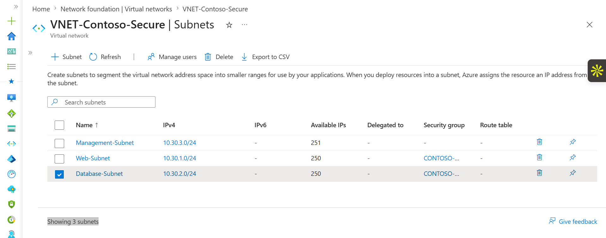

---

# Web Server Configuration

## SSH Access

Connected to the Web VM through restricted SSH access.

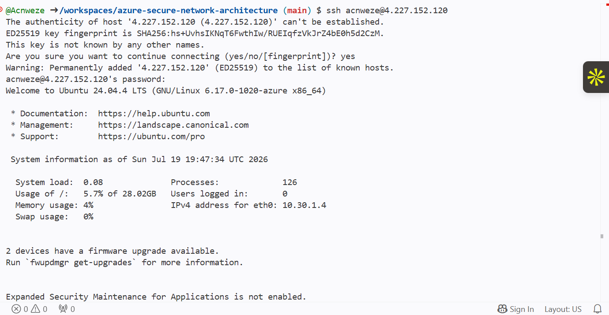

---

## Nginx Deployment

Installed and configured Nginx as the web server.

Service status:

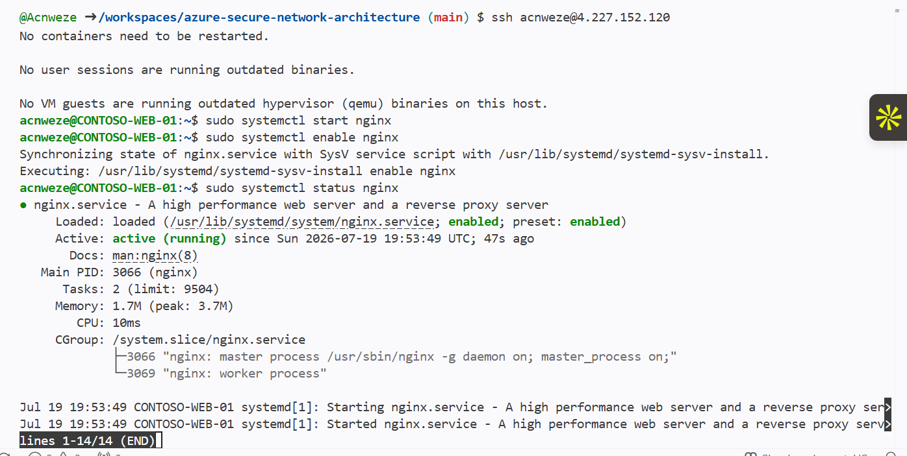

Web page validation:

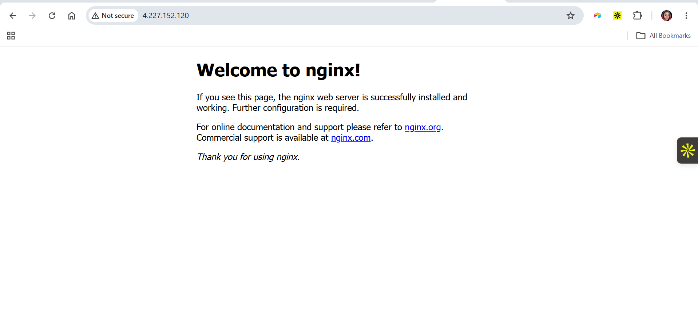

---

# Database Server Configuration

## Database VM Access

Connected to the private database server.

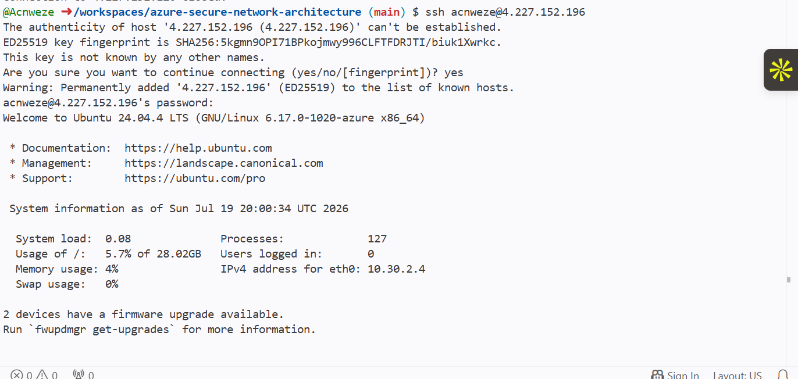

---

## MySQL Installation

MySQL was installed and configured on the database server.

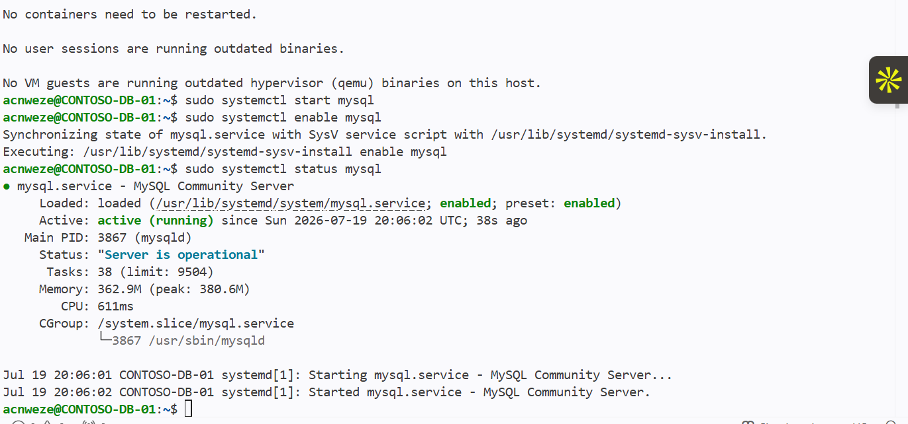

---

## MySQL Network Configuration

Updated MySQL binding to allow private network communication.

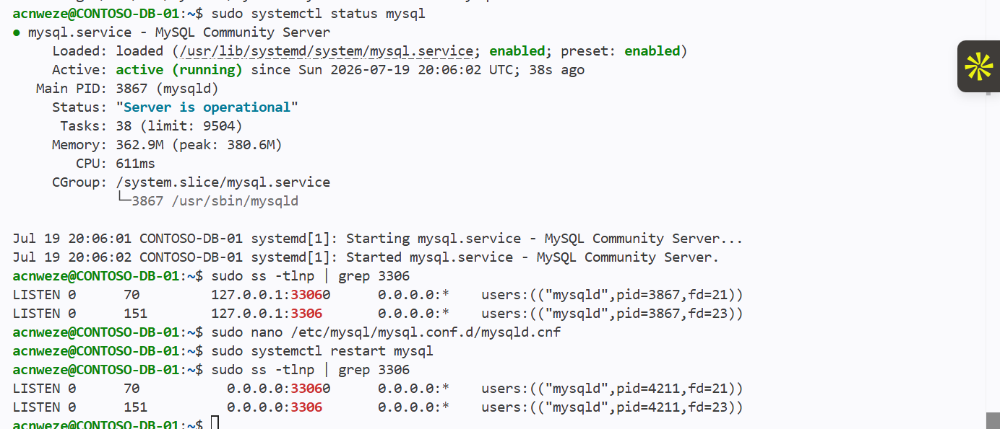

---

# Network Security Groups (NSGs)

## Web Tier NSG

Implemented rules to control:

* HTTP access
* HTTPS access
* Restricted SSH administration

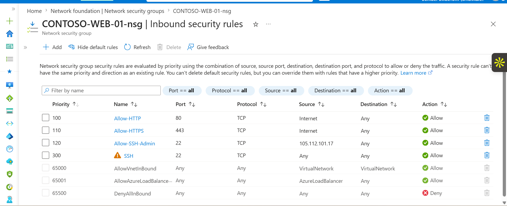

SSH access was limited to the administrator public IP.

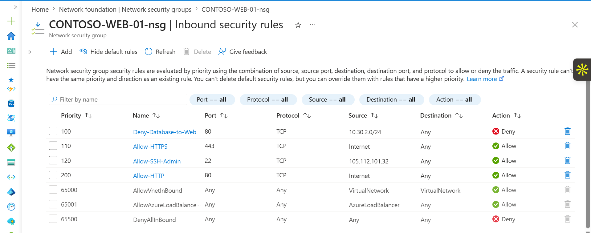

---

## Database Tier NSG

Database access was restricted to required traffic only.

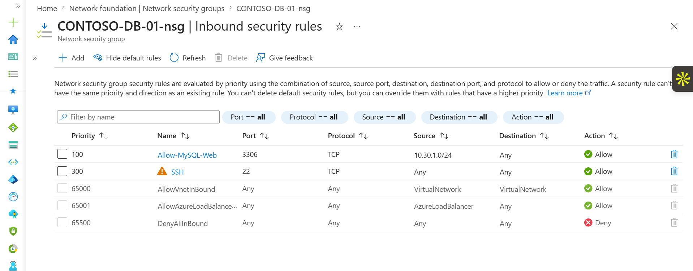

---

# Security Testing

## Test 1 — Web Server to Database Connection

Allowed traffic:

```text
Source:
CONTOSO-WEB-01
10.30.1.4

Destination:
CONTOSO-DB-01
10.30.2.4

Protocol:
TCP

Port:
3306
```

Result:

Successful MySQL connection

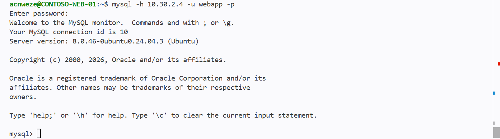

---

## Test 2 — MySQL User Restriction

Created a dedicated database user:

```text
webapp@10.30.1.%
```

This limits database access to the Web subnet only.

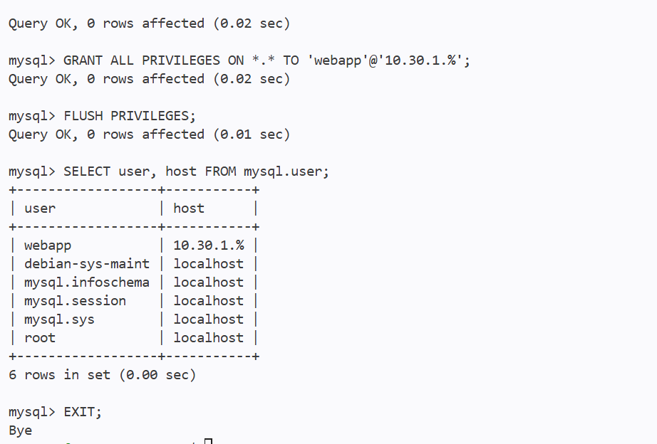

---

## Test 3 — Database to Web HTTP Block

Attempted:

```bash
curl http://10.30.1.4
```

Expected:

Blocked

Result:

Traffic denied by NSG rules

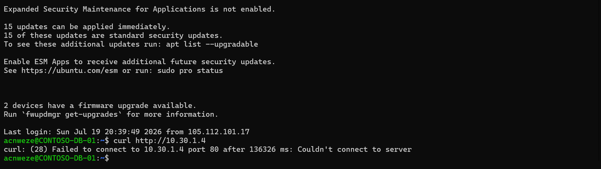

---

# Database Security Improvement

Removed the public IP from the Database VM.

Before:

```text
Database VM
Public IP: Enabled
```

After:

```text
Database VM
Private IP Only
10.30.2.4
```

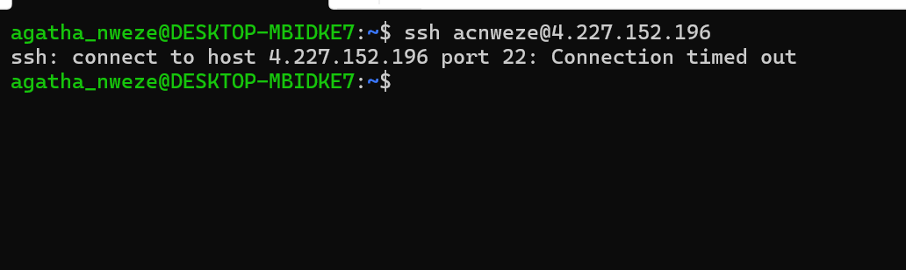

---

# SSH Security Validation

Updated SSH access after administrator IP change.

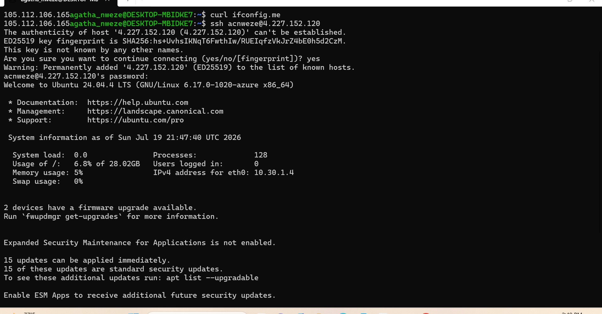

---

# Security Controls Implemented

* Network segmentation using Azure subnets
* Web tier separated from database tier
* NSG-based traffic filtering
* Restricted SSH administration
* Database private access only
* MySQL access limited to Web subnet
* Blocked unauthorized communication paths
* Tested security rules with real traffic validation

---

# Key Learnings

Through this project, I practiced:

* Azure Virtual Network design
* Subnet segmentation
* Network Security Group configuration
* Linux VM administration
* Nginx deployment
* MySQL server configuration
* Secure cloud architecture principles
* Security testing and validation

---

# Project Status

Completed

This project demonstrates a production-style Azure network security architecture with controlled access, segmentation, and validated security rules.
